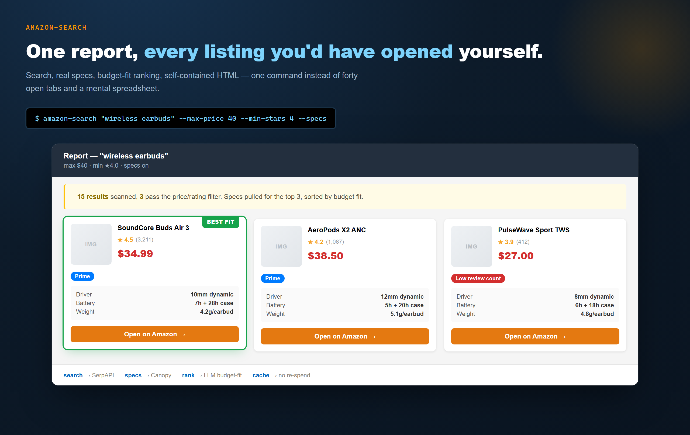
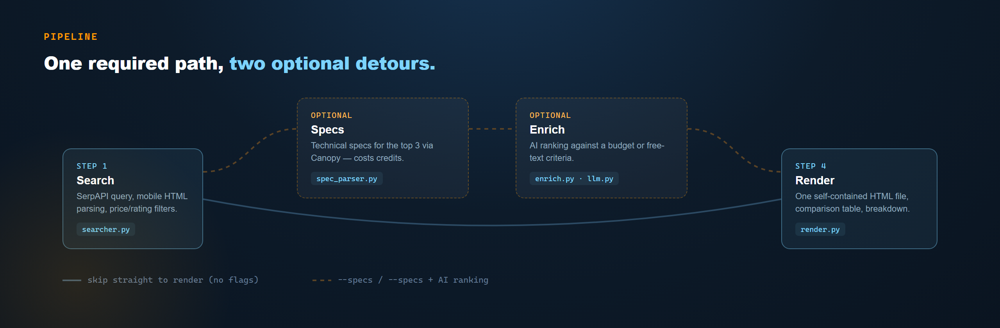

# amazon-search

**Stop scrolling through 40 tabs of Amazon listings.** One command searches, pulls the real
technical specs, ranks by fit-for-budget, and hands you back a single report — same query in,
same shape out, every time. No manual curation, no spreadsheet.

```bash
amazon-search "wireless earbuds" --max-price 40 --min-stars 4 --specs --dedup \
  --criteria "noise cancelling,water resistant" --junk "toy,kids"
```



*Illustrative report (sample data) — the real output looks exactly like this: a summary line,
badges for what actually matters (fit, Prime, low review count), specs pulled automatically for
the top candidates.*

## What it does



1. **Search** (`amazon_search/searcher.py`) — SerpAPI Amazon search, mobile HTML parsing,
   price/star filters.
2. **Specs** (`amazon_search/spec_parser.py`, `specs.py`) — fetches technical specifications for
   the top candidates (optional, costs API credits).
3. **Enrich** (`amazon_search/enrich.py`, `llm.py`) — optional AI ranking/comparison pass against
   a budget or free-text criteria.
4. **Render** (`amazon_search/render.py`, `html_gen.py`) — a single self-contained HTML report:
   image cache inlined, comparison table, per-product breakdown.
5. **Cache + quota** (`amazon_search/cache.py`, `quota.py`) — repeated queries don't re-spend API
   credits; `--quota` / `--cache-status` show what's left before you run.

## Quick start

```bash
pip install -r requirements.txt   # click, rich, requests, Pillow
export SERPAPI_KEY="..."          # search
export CANOPY_KEY="..."           # optional, for --specs
python -m amazon_search "wireless earbuds" --max-price 40 --min-stars 4
```

Run from the repo root (the `amazon_search` package sits one level down). Works fine outside
Termux too — `termux-open` (auto browser launch) is best-effort and silently skipped if
unavailable.

## Project layout

```
amazon_search/            the package (import as amazon_search / python -m amazon_search)
  main.py __main__.py       CLI entry point (click), thin wrapper over pipeline.run()
  pipeline.py                the one search+enrich flow, in a deliberate order (see below)
  searcher.py                SerpAPI search + mobile HTML parsing
  spec_parser.py specs.py    technical spec extraction
  enrich.py llm.py           optional AI ranking/comparison pass
  render.py html_gen.py      HTML report generation (generate_report(), sectioned)
  imagecache.py              product image caching (inlined into the report)
  cache.py quota.py          API cache + quota tracking
  config.py config_search.py configuration
  logger.py                  run logging
  report.py                  library-style wrapper over pipeline.run(), used by night_runner.py
  scoring.py                 feature-fit scoring + negative-sampling exclusion (generic)
  query_suggest.py           query variants — deterministic (free) + AI (opt-in, --suggest-queries)
  dedup.py                   rebrand/same-mold detection: pHash photos (incl. mirrored/resized),
                             numeric title+bullet fingerprint, pseudo-brand signal, confidence
  montage.py                 numbered thumbnail grid, embedded in the report with --montage
  video_review.py            factual claims + coverage mined from real YouTube review transcripts
                             (channel diversity, affiliate-link detection in descriptions)
scripts/                  standalone PowerShell runners (night batch job)
tests/                    regression tests over the pure-logic core (python -m unittest discover tests)
docs/                     README images
```

## Rebrand detection (the part other tools don't do)

The same physical product gets relisted under many "brands" at different prices. Three
independent signals catch it, and they collaborate:

1. **Photo pHash** — identical/resized/**mirrored** stock photos group together (cheap:
   32×32 downscale + 64-bit hashes, milliseconds for a whole pool).
2. **Numeric fingerprint** — rebrands that shot their own photo still quote the same
   measurements ("20.3x7.6 cm", "250g") in title and bullets. Shared rare number+unit
   tokens group them (year-like and unit-less numbers are ignored).
3. **Pseudo-brand score** — trademark-registry generated names ("XKJIYU": no vowels, rare
   letters, all caps) raise family confidence; never auto-exclude, always shown for a human eye.

4. **Scene matching** (`--deep-dedup`, needs opencv) — the same product *re-photographed*
   inside a different scene (3 copies, a model wearing it, a lifestyle shot). SIFT features +
   RANSAC geometric check; measured on a real case: true matches 13-44 inliers, false ≤7,
   threshold 10. Slow (~1s/pair), so it only runs on same-category items not already grouped.

The report shows each family with photos side by side, the price spread ("same item seen for
€X less"), and — with `--montage` — the whole pool as one numbered image grid where duplicates
jump out visually. Cards in the same family carry a colored border + "stesso prodotto" chip.

## Big balanced pools

`--price-bands "5-15,15-30,30-80"` runs one search per price band (Amazon's native price
filter): the first organic results are almost all cheap, so banding is how you actually get
100+ products across the whole price spectrum instead of 70 budget clones. Combined with
`--categorize-preset neck` (13 keyword categories, measured 99% on a real 96-product pool)
the report splits everything into scannable sections without any AI call.

`--dedup`, `--criteria`, `--junk`, `--pull-asin` are all wired into `pipeline.run()` and show up
as real sections in the report (same-photo families, feature-fit chips, a collapsed exclusion
list) — not hidden behind a badge. `montage.py` and `video_review.py` stay opt-in side tools
(`--montage` writes a PNG for manual review; video claims need a separate `video_review` run,
too slow/API-hungry to be automatic) — recovered and generalized from real product research
(anti-snoring collars, smart rings) where text-only classification measured 53% precision
against a manually-labeled set (see `dedup.py`/`montage.py` docstrings — that number is one
measured test on one product category, not a guarantee).

## Status

Functional, used for real product research (see `PROGRESS.md`, `DESIGN_PLAN.md`,
`HTML_DETAILED_QA.md` for design history and QA notes). Born on Termux/Android, runs anywhere
Python does.

## License

MIT.
